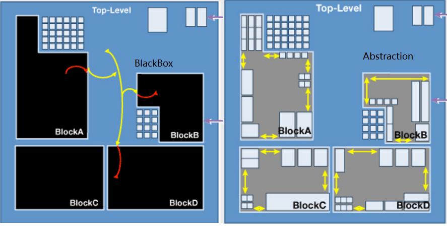
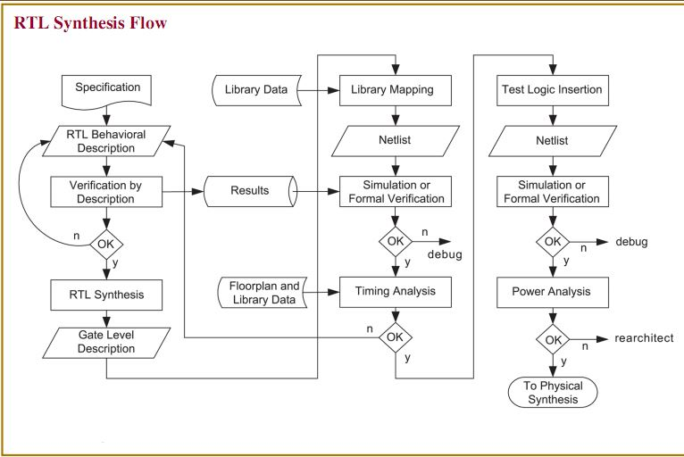
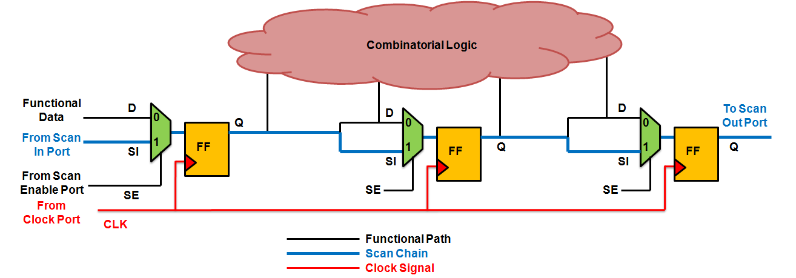
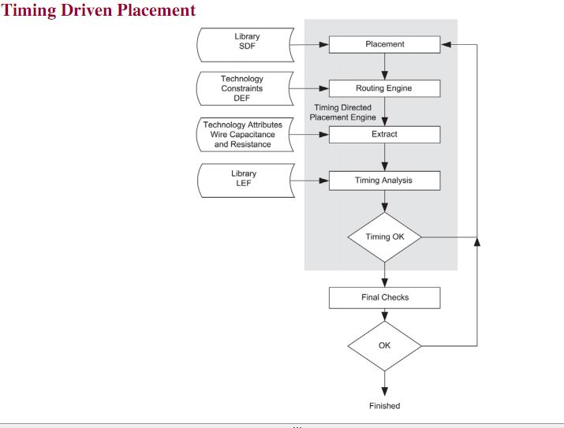

# ASIC Physical Deisign Introduction  Bing YU, Oct 2016 

---

# About Me 

- Physics major by education, both Undergrads and Masters
- Self study the IC Design course in  EECS department of UC Berkely
- Start my career as ASIC-PD Engineer at VIA(S3) in 2005 
- Now working as ASIC-PD Enginer at NVIDA

---
# Outline 

## The Big Picture
- The semiconductor and ASIC 
- How the PD fit in the overall AISC flow 

## In and Out of ASIC-PD 
- Steps of from RTL to GDSII 

## Commercial and In-house tools  
- EDA: The drive of the PD Automations   
- Skillset of the PD engineer 

## Challenges of PD Engineer 

## Resource and links 

## Reserve 10 minutes to Q&A 

---
# Semicoductor Ecosystem   

---
# ASIC's Life 

---

# Hierachical Design 

- Today's real ASIC is too complex and too large to fit in the EDA tools
- Partitioning, Implement the blocks, integrate together 
- The key is budgeting and Partitioning is an art 

---

# Synthesis: Concept  

- Mapping the RTL to Gate-levle Netlist(NL)  
- Constraint is set for better Quality of Result(QoR)
- Automation start in the 80s and get mature in 90s and 00s 
- Optimize target is performace(speed) and area 
- Power get into the play in 2010 as the mobile become main stream SOC  

---

# Syntheis: Chart 

---

# Design for Test 

- Adding part of the logic for test purpose 
- Test the manufacture fault  
- Screening the chip based on the performent 
- The basic DFT concept is scan shift and scan caputre 
- DFT is becoming the most hot area in the industry 

---

# PD Flow: Chart 

---

# PD Flow: Place 

- Mapping the std cell netlist to tow dementional layout 
- Location is is real 
- Net connection is virtual  
- Optimize target is congestion and timing 
- Area is key cost here, think 1% area is 1M USD 

---

# PD Flow: Routing 

- Based on the placment, and connect the net with real wire 

---

# PD Flow: RC Extraction 

- Abstract the real world physical information into R&C 
- Extract the Risistance and Capacitance into **annoatated** netlist 

---

# PD Flow: Timing Verification 

- ** Does the chip's performance meet the spec?**

- Static Timing Analysis Checking all the timing graph exhaustively  
- Std cells' timing is from the std cell timing lib 
- Wires timing is calcualted by the timing engine of EDA tools 

---

# PD Flow: Physical Verification 

- **Does the layout qualified for Foundry to manufacture? **

- DRC: Design rule check
- LVS: Layout vs schemtic 
- ERC: Electronic rule check 
- EM:  Eletrial migration   

---

# PD Flow: Power Verificaiton 

- **Does the chip meet the power spec**

---

# PD Flow: Formal Verificaiton 

- **Does the netlist match the RTL? **

---

# Tapeout 

---

# EDA Tools 

